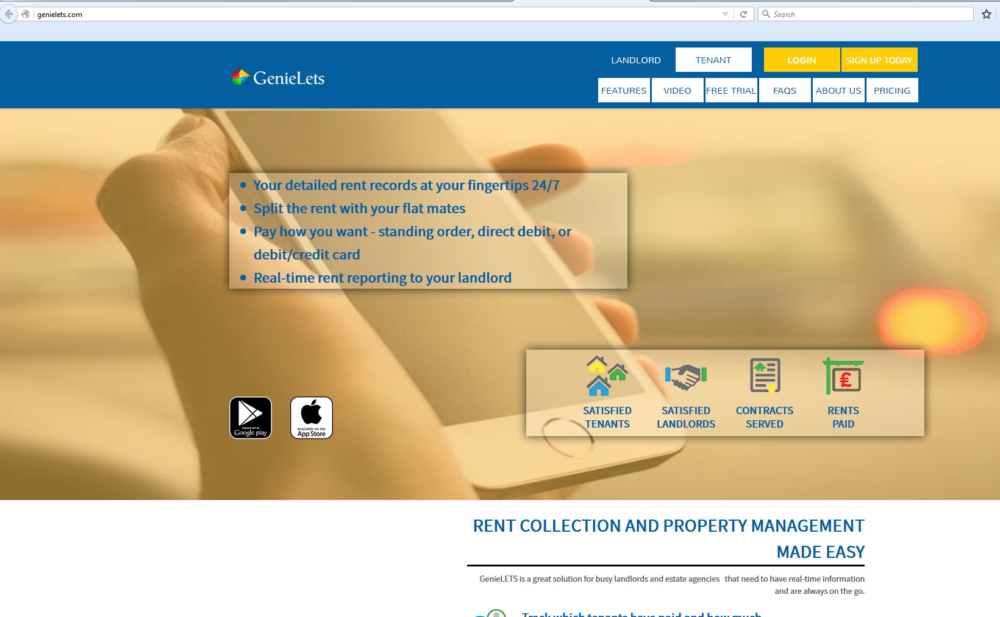

# Technology Used.

1. language: Ruby
2. platform: Rails
3. front end script: jQuery
4. main gem: devise, activeadmin thin, stripe, whenver, passenger, capistrano
5. main feature: 
 >1. User authentication using devise gem.
 >2. Payment integration using Stripe API.
 >3. AWS S3 - file uploading.
 >4. Admin panel using activeadmin gem.
 >5. Unit Test using Rspec, capistrano, fatorygirl
 >6. PhoneGap mobile app.
 >7. RESTful API for mobile app back end point.
 >8. Social Media integration-Facebook, Linkedin, Twitter, Pinterest, Google.
6. hosting: AWS EC2 using Nginx

# Portfolio

